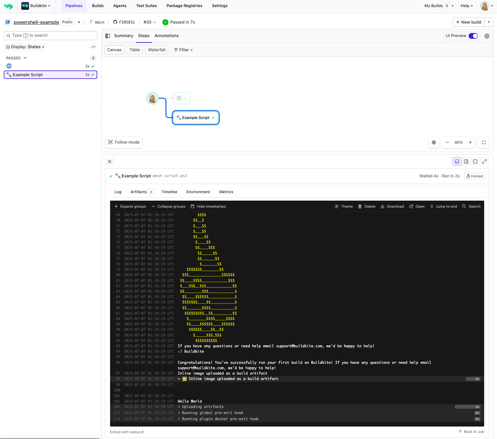

# Buildkite PowerShell Pipeline Example

This repository is an example [Buildkite](https://buildkite.com/) pipeline that runs a simple PowerShell script: [`script.ps1`](script.ps1).

👉 **See this example in action:** [buildkite/powershell-example](https://buildkite.com/buildkite/powershell-example/builds/latest?branch=main)

<!-- docs:start -->

## How it works

This example:
- Runs [`script.ps1`](script.ps1) as part of the pipeline
- Prints debug output and an inline image
- Uploads a test artifact
- Exits cleanly with success (`exit 0`)

PowerShell can be used for many build, deploy, or scripting tasks across Windows, Linux, and macOS agents.

<!-- docs:end -->

## License

See [LICENSE.md](LICENSE.md) (MIT)
